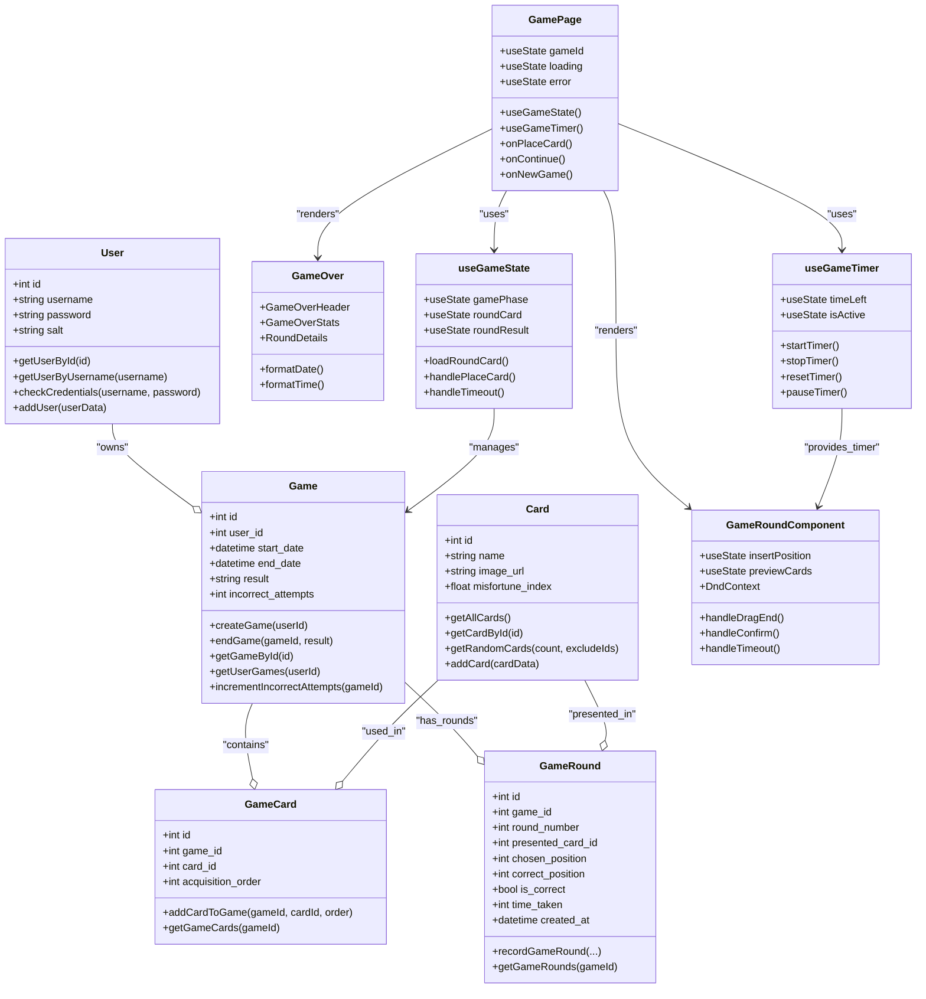
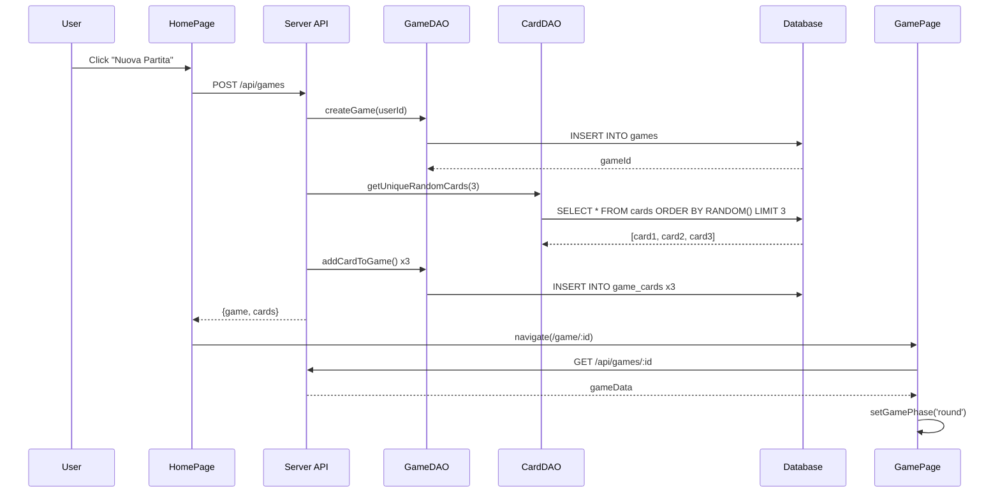
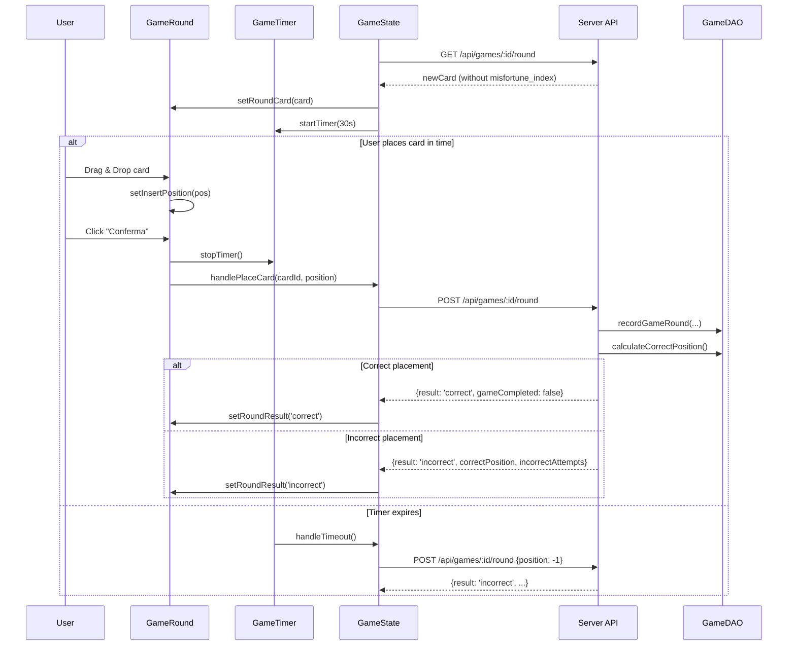
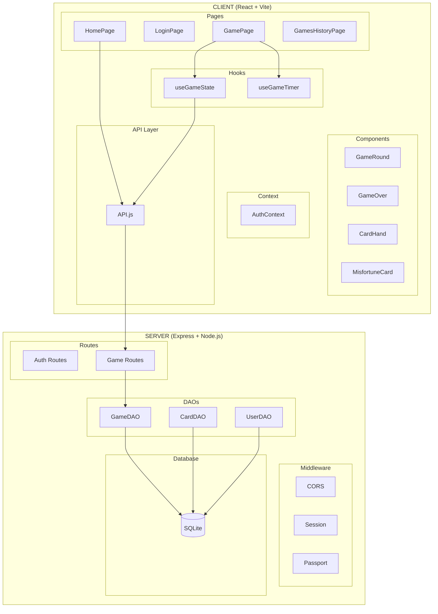
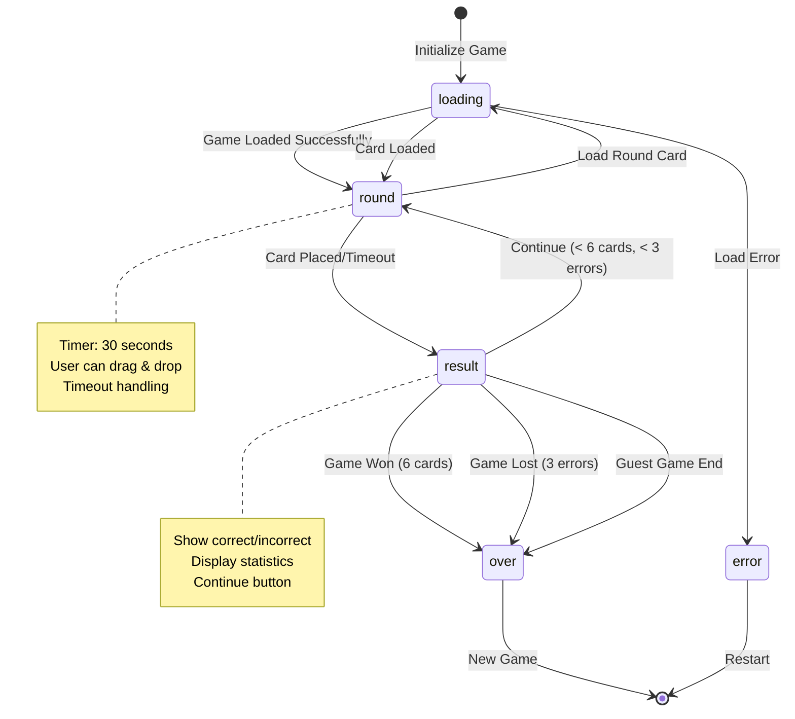
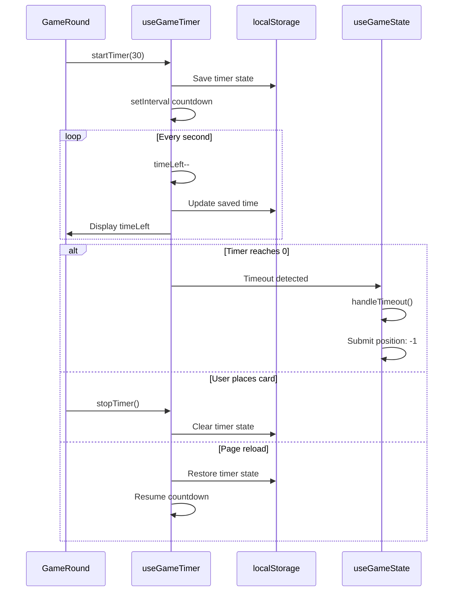
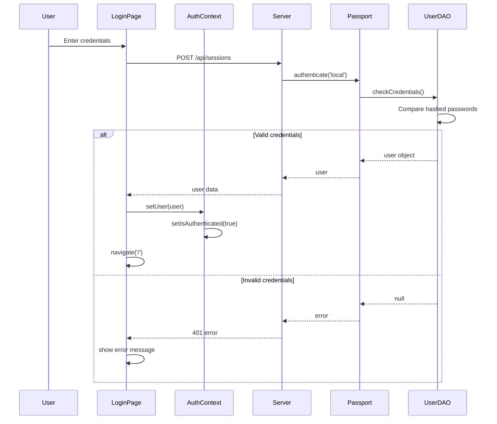
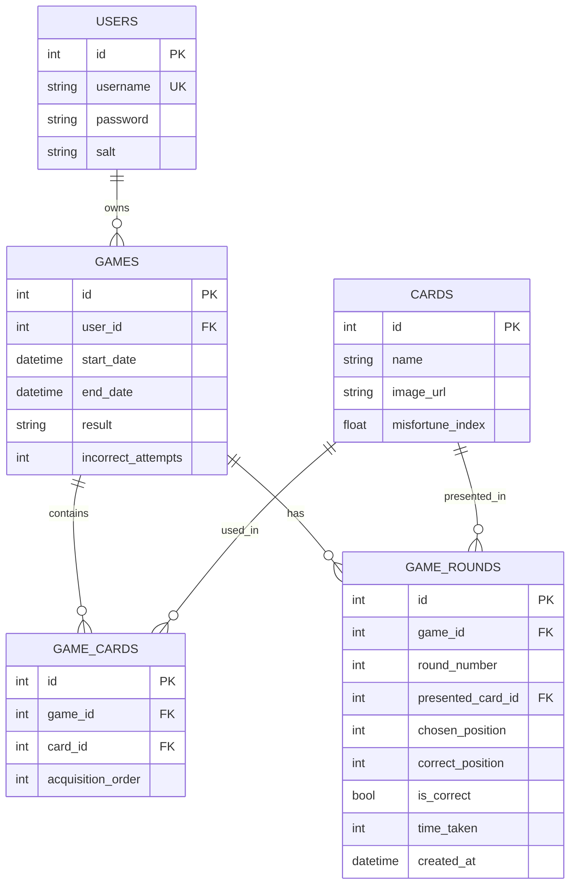
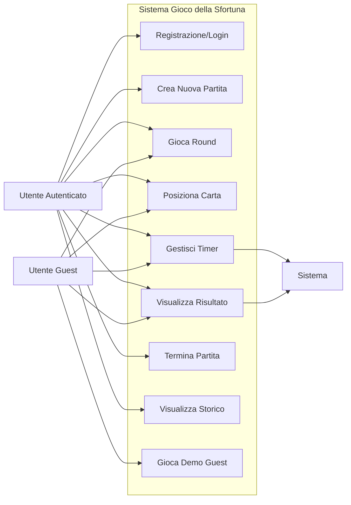

# 🎮 Gioco della Sfortuna - Documentazione Tecnica Completa

## 🏗️ Architettura del Sistema

### 📁 Struttura dei File
```
📦 esame1-gioco-sfortuna-itsPinguiz/
├── 📁 client/                    # Frontend React
│   ├── 📁 src/
│   │   ├── 📁 api/              # Gestione API
│   │   ├── 📁 components/       # Componenti React
│   │   ├── 📁 contexts/         # Context per autenticazione
│   │   ├── 📁 hooks/           # Custom hooks
│   │   ├── 📁 pages/           # Pagine principali
│   │   └── 📁 utils/           # Utilità varie
│   └── 📁 tests/               # Test E2E e integrazione
├── 📁 server/                   # Backend Express.js
│   ├── 📁 db/                  # Database e DAO
│   ├── 📁 data/                # Dati di esempio
│   ├── 📁 public/              # File statici (immagini carte)
│   └── 📁 test/                # Test del server
└── 📁 img/                     # Screenshot per documentazione
```

### 🔧 Stack Tecnologico

#### Frontend
- **React 19.1.0**: Framework principale
- **React Router DOM 7.6.1**: Routing
- **Bootstrap 5.3.6**: Styling e componenti UI
- **@dnd-kit**: Drag & Drop per il gameplay
- **Axios**: Client HTTP per API calls
- **Vite**: Build tool e dev server

#### Backend
- **Node.js + Express.js**: Server web
- **SQLite3**: Database locale
- **Passport.js**: Autenticazione
- **express-session**: Gestione sessioni
- **CORS**: Cross-Origin Resource Sharing

---

## 📊 Diagrammi UML - Architettura e Flussi

### 🏛️ 1. Diagramma delle Classi (Class Diagram)

### 🔄 2. Diagramma di Sequenza - Creazione Partita



### 🎮 3. Diagramma di Sequenza - Round di Gioco



### 🏛️ 4. Diagramma dell'Architettura del Sistema



### 🎯 5. Diagramma di Stato - Game Phase



### ⏱️ 6. Diagramma di Sequenza - Gestione Timer



### 🔐 7. Diagramma di Sequenza - Autenticazione



### 📊 8. Diagramma ER (Entity Relationship)



### 🎮 9. Diagramma Casi d'Uso



### 📱 Riepilogo Architettura UML

#### 🎯 **Punti Chiave del Flusso:**

1. **Frontend React**: SPA con routing, state management locale, hooks personalizzati
2. **Backend Express**: API RESTful, autenticazione Passport, sessioni
3. **Database SQLite**: 5 tabelle relazionali, integrità referenziale
4. **Timer Client-Side**: Gestione timeout con persistenza localStorage
5. **Drag & Drop**: Interfaccia intuitiva con @dnd-kit
6. **Dual Mode**: Partite demo vs complete per guest/authenticated users

#### 🔄 **Flusso Principale:**
**Login/Guest** → **Crea Partita** → **Load Round Card** → **Timer Start** → **User Interaction** → **Submit/Timeout** → **Process Result** → **Continue/End**

---

## 💾 Schema Database

Il sistema utilizza un database SQLite con 5 tabelle principali:

### 👤 Tabella `users`
```sql
CREATE TABLE users (
    id INTEGER PRIMARY KEY AUTOINCREMENT,
    username TEXT UNIQUE,
    password TEXT,
    salt TEXT
);
```
**Scopo**: Gestione utenti registrati con autenticazione sicura.

### 🃏 Tabella `cards`
```sql
CREATE TABLE cards (
    id INTEGER PRIMARY KEY AUTOINCREMENT,
    name TEXT NOT NULL,
    image_url TEXT NOT NULL,
    misfortune_index REAL NOT NULL
);
```
**Scopo**: Catalog di tutte le carte con le situazioni sfortunate universitarie.

**Esempi di carte**:
- "File con la tesi corrotto" (misfortune_index: 95.5)
- "Computer rubato" (misfortune_index: 92.5)
- "Dimenticato l'esame" (misfortune_index: 80.5)
- "Caffè rovesciato sugli appunti" (misfortune_index: 65.5)
- "Dormire durante la lezione" (misfortune_index: 30.0)

### 🎮 Tabella `games`
```sql
CREATE TABLE games (
    id INTEGER PRIMARY KEY AUTOINCREMENT,
    user_id INTEGER,                -- NULL per partite guest
    start_date DATETIME NOT NULL,
    end_date DATETIME,
    result TEXT,                    -- 'won' | 'lost'
    incorrect_attempts INTEGER DEFAULT 0,
    FOREIGN KEY (user_id) REFERENCES users (id)
);
```
**Scopo**: Tracciamento delle partite con metadati temporali e risultati.

### 🃏 Tabella `game_cards`
```sql
CREATE TABLE game_cards (
    id INTEGER PRIMARY KEY AUTOINCREMENT,
    game_id INTEGER NOT NULL,
    card_id INTEGER NOT NULL,
    acquisition_order INTEGER NOT NULL,
    FOREIGN KEY (game_id) REFERENCES games (id),
    FOREIGN KEY (card_id) REFERENCES cards (id)
);
```
**Scopo**: Relazione many-to-many tra partite e carte con ordine di acquisizione.

### 🎯 Tabella `game_rounds`
```sql
CREATE TABLE game_rounds (
    id INTEGER PRIMARY KEY AUTOINCREMENT,
    game_id INTEGER NOT NULL,
    round_number INTEGER NOT NULL,
    presented_card_id INTEGER NOT NULL,
    chosen_position INTEGER NOT NULL,      -- -1 per timeout
    correct_position INTEGER NOT NULL,
    is_correct BOOLEAN NOT NULL,
    time_taken INTEGER,                    -- secondi impiegati
    created_at DATETIME DEFAULT CURRENT_TIMESTAMP,
    FOREIGN KEY (game_id) REFERENCES games (id),
    FOREIGN KEY (presented_card_id) REFERENCES cards (id)
);
```
**Scopo**: Tracciamento dettagliato di ogni tentativo con posizioni e tempi.

---

## 🚀 Meccaniche di Gioco

### 🔄 Flusso di Gioco Principale

1. **Inizializzazione Partita**
   ```javascript
   // Server: creazione con 3 carte iniziali
   const createGameWithCards = async (userId) => {
     const game = await gameDao.createGame(userId);
     const cards = await getUniqueRandomCards(3);
     // Aggiunge carte al gioco con ordine di acquisizione
   };
   ```

2. **Round di Gioco**
   ```javascript
   // Client: caricamento carta round
   const loadRoundCard = async () => {
     const card = await getNextRoundCard(gameId);
     // Carta viene mostrata SENZA misfortune_index
   };
   ```

3. **Posizionamento Carta**
   ```javascript
   // Server: calcolo posizione corretta
   const calculateCorrectPosition = (gameCards, roundCard) => {
     const sortedCards = [...gameCards].sort((a, b) => a.misfortune_index - b.misfortune_index);
     // Trova la posizione corretta basata sull'indice di sfortuna
   };
   ```

### ⚡ Sistema di Timer e Timeout

- **Durata Round**: 30 secondi per ogni posizionamento
- **Gestione Timeout**: Se il tempo scade, viene inviata una posizione speciale (-1)
- **Fallback**: Sistema di recupero per errori di rete durante il timeout

```javascript
// Client: gestione timeout con fallback
const handleTimeUp = async () => {
  try {
    const result = await submitCardPlacement(gameId, roundCard.id, TIMEOUT_POSITION);
    // Aggiorna stato con risultato server
  } catch (error) {
    // Fallback locale per problemi di rete
    const fallbackResult = createFallbackResult(attemptsMade);
  }
};
```

### 🎯 Sistema di Punteggio e Tentativi

- **Tentativi Massimi**: 3 errori per partita completa
- **Guest Mode**: Solo 1 tentativo per round demo
- **Calcolo Risultato**: Basato su posizione corretta vs scelta del giocatore

---

## 🎮 Interfaccia Utente e Componenti

### 🖼️ Componenti Principali

#### `GameRound.jsx` - Interfaccia di Gioco
- **Drag & Drop**: Utilizza @dnd-kit per posizionamento intuitivo
- **Preview**: Mostra anteprima del posizionamento in tempo reale
- **Timer Visivo**: Countdown con warning a 10 secondi
- **Responsive**: Ottimizzato per desktop e mobile

```jsx
// Drag & Drop con anteprima
const handleDragOver = (event) => {
  const { active, over } = event;
  if (active.id === 'new-card') {
    // Mostra anteprima posizionamento
    const newPreview = createPreviewWithNewCard(sortedCards, roundCard, position);
    setPreviewCards(newPreview);
  }
};
```

#### `MisfortuneCard.jsx` - Componente Carta
- **Design**: Carta stilizzata con immagine SVG e indice di sfortuna
- **Stati**: Normale, selezionabile, feedback risultato (✓/✗)
- **Responsive**: Dimensioni adattive per diversi dispositivi

#### `GameOver.jsx` - Schermata Finale
- **Statistiche**: Dettaglio completo della partita
- **Cronologia Round**: Mostra ogni tentativo con carta, posizioni e tempi
- **Navigazione**: Opzioni per nuova partita o ritorno home

### 📱 Design Responsive

Il gioco è completamente responsive con breakpoint per:
- **Desktop**: > 768px - Layout completo con tutte le funzionalità
- **Tablet**: 768px-480px - Layout compatto con scroll orizzontale
- **Mobile**: < 480px - Layout verticale ottimizzato per touch

---

## 🔐 Sistema di Autenticazione

### 👤 Gestione Utenti

Il sistema supporta due modalità:

#### **Utenti Registrati**
- **Login**: Username/password con sessioni persistenti
- **Funzionalità Complete**: Partite complete, cronologia, statistiche
- **Sicurezza**: Password hash con salt, sessioni Express

#### **Modalità Guest/Demo**
- **Accesso Immediato**: Nessuna registrazione richiesta
- **Limitazioni**: 1 solo round, nessun salvataggio cronologia
- **Conversione**: Possibilità di registrarsi per salvare progresso

```javascript
// AuthContext - gestione stato autenticazione
const AuthProvider = ({ children }) => {
  const [user, setUser] = useState(null);
  const [loading, setLoading] = useState(true);
  
  // Auto-login al caricamento app
  useEffect(() => {
    checkAuthenticationStatus();
  }, []);
};
```

---

## 🛠️ Gestione Stato e Hooks

### `useGameState.js` - Hook Principale di Gioco

Gestisce tutto lo stato del gioco con persistenza locale:

```javascript
const useGameState = (gameId) => {
  // Stati principali
  const [game, setGame] = useState(null);
  const [cards, setCards] = useState([]);
  const [roundCard, setRoundCard] = useState(null);
  const [gamePhase, setGamePhase] = useState('loading');
  
  // Persistenza localStorage per recovery
  useEffect(() => {
    saveGameStateToLocalStorage(gameId, roundCard, gamePhase, incorrectAttempts);
  }, [gameId, roundCard, gamePhase, incorrectAttempts]);
  
  // Funzioni principali
  return {
    // Stato
    game, cards, rounds, loading, error,
    roundCard, gamePhase, roundResult, incorrectAttempts,
    
    // Azioni
    loadRoundCard,
    handlePlaceCard,
    handleTimeUp,
    onContinue
  };
};
```

### `useGameTimer.js` - Gestione Timer

Hook dedicato per il countdown di round:

```javascript
const useGameTimer = () => {
  const [timeLeft, setTimeLeft] = useState(30);
  const [isRunning, setIsRunning] = useState(false);
  
  return {
    timeLeft,
    startTimer: () => setIsRunning(true),
    stopTimer: () => setIsRunning(false),
    resetTimer: () => setTimeLeft(30)
  };
};
```

---

## 🌐 API Routes e Endpoint

### 🔒 Autenticazione
- `POST /api/sessions` - Login utente
- `GET /api/sessions/current` - Verifica sessione attiva
- `DELETE /api/sessions/current` - Logout

### 🎮 Gestione Partite
- `POST /api/games` - Crea nuova partita
- `GET /api/games` - Lista partite utente (protetta)
- `GET /api/games/:id` - Dettagli partita specifica
- `GET /api/games/:id/round` - Carta per nuovo round
- `POST /api/games/:id/round` - Submissione posizionamento
- `POST /api/games/:id/end` - Terminazione manuale partita

### 📊 Formato Dati API

**Creazione Partita**:
```json
{
  "game": {
    "id": 123,
    "user_id": 1,
    "start_date": "2025-06-23T10:30:00.000Z",
    "result": null,
    "incorrect_attempts": 0
  },
  "cards": [
    {
      "id": 45,
      "name": "Dormire durante la lezione",
      "image_url": "/images/cards/sleep_during_class.svg",
      "misfortune_index": 30.0,
      "acquisition_order": 1
    }
  ]
}
```

**Submissione Round**:
```json
{
  "cardId": 67,
  "position": 2,
  "timeTaken": 15
}
```

**Risposta Round**:
```json
{
  "result": "correct",
  "card": {
    "id": 67,
    "name": "Caffè rovesciato sugli appunti",
    "misfortune_index": 65.5
  },
  "correctPosition": 2,
  "gameCompleted": false,
  "incorrectAttempts": 0
}
```

---

## 📝 Gestione Errori e Resilienza

### 🛡️ Strategie di Error Handling

#### **Frontend**
- **Network Errors**: Retry automatico con backoff
- **State Recovery**: Ripristino da localStorage in caso di reload
- **Fallback UI**: Messaggi informativi per l'utente

```javascript
// Esempio: gestione errore con fallback
const handlePlaceCard = async (cardId, position) => {
  try {
    const result = await submitCardPlacement(gameId, cardId, position);
    return result;
  } catch (error) {
    console.error('Errore placement:', error);
    // Fallback: aggiorna stato locale
    const fallbackResult = createFallbackResult(attempts);
    setRoundResult(fallbackResult);
  }
};
```

#### **Backend**
- **Database Transactions**: Operazioni atomiche per consistenza
- **Input Validation**: Sanitizzazione e validazione dati
- **Error Logging**: Logging dettagliato per debugging

### 🔄 Sistema di Backup e Recovery

- **localStorage**: Salvataggio stato gioco per recovery post-refresh
- **Database**: Backup automatico delle partite completate
- **Cleanup**: Rimozione automatica stati obsoleti

---

## 🚀 Deployment e Performance

### ⚡ Ottimizzazioni Performance

#### **Frontend**
- **Code Splitting**: Caricamento lazy delle pagine
- **Image Optimization**: SVG ottimizzate per carte
- **Bundle Analysis**: Monitoring dimensioni bundle

#### **Backend**
- **Database Indexing**: Indici su foreign keys
- **Query Optimization**: Query efficienti con prepared statements
- **Session Management**: Configurazione ottimale sessioni Express

---

## 🛠️ Development Workflow

### 📋 Comandi Principali

```bash
# Setup iniziale
npm install             # Install dipendenze client
cd server && npm install # Install dipendenze server

# Sviluppo
npm run dev             # Client su porta 5173
cd server && node index.mjs  # Server su porta 3001
```

### 🔄 Database Management

```bash
# Reset database con dati sample
node index.mjs --reset

```

### 📁 File di Configurazione

- `vite.config.js`: Configurazione build frontend
- `eslint.config.js`: Linting rules
- `package.json`: Dipendenze e scripts

### 📚 Tecnologie e Framework

Un ringraziamento speciale alle comunità open source di:
- React.js e l'ecosistema React
- Express.js e Node.js
- SQLite per la semplicità di deployment
- @dnd-kit per le interazioni drag & drop
- Bootstrap per i componenti UI

---

*Documentazione aggiornata al: 26 Giugno 2025*
